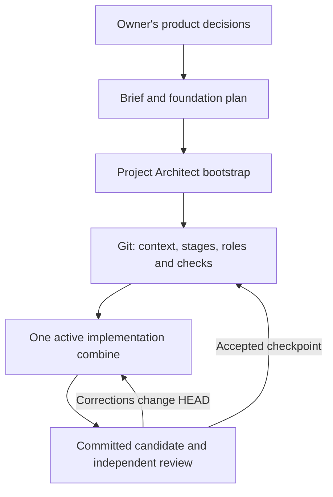
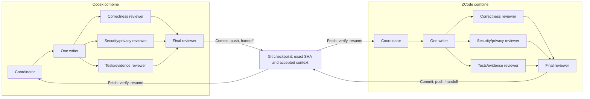
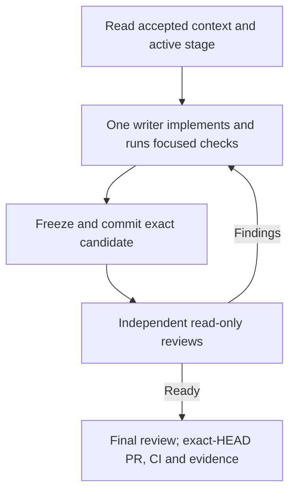

# Project Architect

**A reusable foundation for long running software projects built with AI agents.** Project Architect helps an owner turn a product discussion into a versioned project brief, a staged plan, repository rules, and a repeatable way to implement and review changes. It is intended for work that lasts longer than one chat or one model session.

The goal is a project that another agent, tool, or human can pick up from an agreed Git state: what was decided, which stage is active, what changed, how it was checked, and what still needs approval. It does not make AI output infallible or give an agent authority that the owner has not granted.

> **Status:** An evolving foundation. Start with a small isolated project and review the generated rules against your own stack, permissions, and deployment process.

## Who is it for?

| Situation | How it helps |
| --- | --- |
| A solo developer or project owner works with AI for weeks or months | Decisions and stage boundaries live in the repository, so a new conversation can resume from an accepted state. |
| A small team uses several agents | One writer edits a worktree; independent read-only reviewers inspect a committed candidate against explicit requirements. |
| Work moves between Codex and ZCode | A documented Git checkpoint carries the branch, exact commit, project state, evidence, risks, and next authorized action. |
| A project has expensive checks or limited model usage | Focused checks during development, one aggregate final check, and deliberate handoffs reduce avoidable repeated work. |

A one-line fix rarely needs the full process. Multiple agents and reviews use time and provider limits; choose checkpoint size in proportion to the risk and scope of the change.

## A common starting point: "We have talked it through. How do we actually begin?"

Imagine you have spent days discussing your product with ChatGPT. You have described users, screens, constraints, and priorities, and changed your mind on a few points. You are ready to build, but a single instruction such as “make the app” leaves important questions open: which idea was finally accepted, what belongs in the first release, and how will a new chat know what happened three weeks later?

Project Architect provides a path from that conversation to an orderly repository:

1. **Consolidate decisions.** In the coordinating conversation, open the pinned [CHAT_START.md](CHAT_START.md). The coordinator separates your accepted choices from tentative ideas, marks superseded proposals, and prepares a `PROJECT_BRIEF.md` plus `FOUNDATION_PLAN.md`. You review them and resolve only decisions that would materially change the first stage.
2. **Build the foundation.** Install `skill/project-architect` in the Codex profile doing the setup, or run its bootstrap script directly. Point it at the approved brief and plan. Review the dry run, generate the files, validate them, and accept or revise the proposed technical setup. This creates the structure; it does not start building the product on its own.
3. **Authorize the first stage.** Give the active combine a bounded outcome, such as “implement the appointment form from Stage 1.” It reads the Git context and stage, runs one writer and independent reviews, and reports what the exact committed candidate proves. You decide whether to accept, correct, merge, or deploy according to the project's authority rules.
4. **Continue from the repository.** Each later task starts from the accepted context and current stage. When the conversation gets long, a new coordinator or combine reads those files and the latest checkpoint rather than treating fragments of the old chat as the specification.

You do **not** need to manually copy every message into Markdown. Ask the coordinator to turn a meaningful accepted decision into a concise project update, and review the proposed change. Keep casual exploration in chat until you decide it should constrain future work.

### Where to put things during the project

| What you want to say or change | Where to start | What should persist |
| --- | --- | --- |
| “Could we try this idea?” or “What are the trade-offs?” | Discuss it in the coordinating chat. | Nothing becomes a project requirement until you accept a choice. |
| “We have decided that this behavior is required.” | Tell the coordinator it is accepted and ask it to update the relevant project documents. | A concise decision and any scope or stage change in Git, reviewed by you. |
| “Please build or fix this part now.” | Give the active Codex or ZCode combine the approved stage/checkpoint and acceptance criteria. | Code, targeted checks, exact commit, review findings, and evidence. |
| “The reviewer found a problem.” | Reply in the same active implementation task when possible. | The writer's correction and fresh verdicts for the changed HEAD. |
| “I am moving from Codex to ZCode,” or back. | Invoke the project-local `combine-handoff` process. | A pushed branch, exact SHA, handoff record, risks, and next authorized action. |
| “We are starting a new chat after a break.” | Point it to the repository, accepted context, active stage, and latest checkpoint. | The conversation resumes from Git; it does not silently rewrite past decisions. |

The practical habit is: **explore in conversation, accept decisions explicitly, record accepted state in Git, and assign bounded implementation tasks against that state**. The coordinating chat helps with product choices; the active combine works on the authorized checkpoint. If an implementation uncovers a new product decision, bring that choice back to the owner before expanding scope. The generated project documents describe the detailed roles and stop points.

## The idea in one picture

The optional coordinating conversation prepares a `PROJECT_BRIEF.md` and `FOUNDATION_PLAN.md`. Bootstrap previews and generates the project foundation. Then the project's own documents guide implementation; **Project Architect is primarily used to found or structurally upgrade a project, not invoked for every feature**.

## What the foundation gives you

| Generated part | Purpose |
| --- | --- |
| `PROJECT_CONTEXT.md` and `ROADMAP.md` | Accepted long-lived state, decisions, and delivery stages. Git is the canonical record. |
| Stage and role contracts | Define the active scope, one writer per worktree, read-only reviewers, and a final review. |
| `docs/ORCHESTRATOR_PROTOCOL.md` | Describes the checkpoint cycle and maps the same conceptual roles in either combine. |
| `docs/codex/LOCAL_VERIFICATION.md` and scripts | Set check and evidence rules; a technology profile supplies commands appropriate to the project. |
| `docs/TOOL_HANDOFF_POLICY.md` and `skills/combine-handoff/SKILL.md` | Move an approved checkpoint between Codex and ZCode through a verified Git boundary. |
| `docs/CONTEXT_SERVICES_POLICY.md` and `.codex/context-services.json` | Keep optional Tela/Cortex retrieval isolated, minimal, and subordinate to Git. |

The bootstrap script has a **dry run** and refuses to overwrite different existing files. The `generic` technology profile records policy, but you must define the real build and test commands for your application. An optional `node-postgresql` profile includes stack-specific verification scaffolding. Generated technical choices are proposals until the owner accepts them.

## Two execution combines

Here, a **combine** means an execution environment that coordinates a writer, independent reviewers, and a final review. The project supports two physical combines:

- **Codex** uses native Codex agents. Within Codex, roles can use configured OpenAI models or an authorized custom provider such as Z.AI/GLM. Changing model provider inside Codex is *model routing*, not a physical handoff.
- **ZCode** is a separate application with its own native agent and task setup. It takes the same provider-neutral role contracts and runs its own coordinated checkpoint. Its profiles must be configured and verified on the host where it runs.

**Only one combine owns a checkpoint and one writer owns a worktree at a time.** Prefer separate checkouts or worktrees. A physical switch happens at a deliberate stopping point with committed and pushed state, a clean worktree, a known SHA, and a handoff record. The receiving combine verifies that state and reads the project context before resuming the *already approved* action. A handoff does not approve a new stage, merge, or deployment.

### A concrete handoff example

1. Codex implements a checkpoint and records its branch, exact commit, checks, review status, open risks, and next authorized action.
2. The outgoing combine writes the project-local handoff record, commits and pushes the bounded handoff state, and reports the pushed SHA.
3. ZCode fetches the recorded branch, verifies the exact SHA and clean state, reads the canonical documents, and activates its native writer and independent reviewers.
4. If ZCode changes the candidate, prior review verdicts remain evidence for the *old* commit. The new HEAD needs fresh review and CI before acceptance.

This is also a way to plan around **service-specific usage limits**. You can finish at a safe checkpoint and choose whichever combine is available for the next authorized work. Smaller appropriate roles and avoiding duplicate checks can reduce waste. The handoff preserves work; it **does not transfer, combine, increase, or bypass provider quotas**. Availability, prices, and limits can change, so check them in the relevant service. A configuration file alone does not prove which model actually ran; material agent runs need sanitized runtime model/provider evidence.

## What a checkpoint looks like

The required independent review lanes are **correctness**, **security/privacy**, and **tests/evidence**. The final reviewer considers the candidate and those results. A changed HEAD requires a new verdict; a previous PASS does not silently carry over. At a global checkpoint, the branch, PR, CI, evidence, and handoff identify the exact candidate. Integration authority remains with the owner.

The verification policy favors focused tests while writing and one aggregate final application check, with integration and dependency audits when applicable. It preserves validated caches, cleans up isolated per-run state, and stops task-owned idle virtual machines or container runtimes after checks when no active task or owner-facing preview needs them. Persistent preview data and shared environments have separate ownership boundaries. Evidence must describe commands and logs that actually exist; UI behavior should be checked in the target interface when possible.

If an agent or command times out, inspect its original task and worktree before retrying. A timeout is not proof that the writer stopped. Do not create a second writer for the same worktree merely because the first reply is delayed.

### A small fictional project

Suppose you are building an appointment booking app. You agree that the first stage is a private booking form with no payments. The brief records that boundary; the roadmap puts payments in a later stage. A writer implements only the approved form, and reviewers check the behavior, privacy of submitted details, and evidence for the exact commit. If a reviewer finds that an error message leaks contact details, the writer fixes it and the changed commit is checked again. After a break, another session reads the accepted context and checkpoint record instead of reconstructing decisions from chat fragments.

## Optional Tela and Cortex memory

Native project indexing is preferred where available. A project can separately opt in to **Tela** for semantic retrieval from project documentation and **Cortex** for a small set of curated durable decisions. Both are disabled by default and use project-specific identifiers. Their role is to help find context, especially after a long break; they are not an alternative source of accepted decisions.

Fresh Git state wins any conflict. Auxiliary context failures must not block implementation, review, CI, or handoff. Do not put credentials, personal data, raw logs, full diffs, or chat dumps into these services. Their installation and account permissions are separate from this repository.

## Try it

1. Read the [step-by-step guide](docs/GETTING_STARTED.md). You can use [CHAT_START.md](CHAT_START.md) to prepare the brief and plan in a coordinating conversation, or write them from the [templates](chat/templates/).
2. Pin a release or commit of this repository. Install the whole `skill/project-architect` directory in the Codex profile that will bootstrap, or run its scripts directly. Python 3.11+ and Git are required for the documented workflow; bootstrap needs no Python package install.
3. Review the proposed files with `--dry-run`, then bootstrap into the approved target and run validation. Accept or revise the technical foundation before authorizing the first implementation stage.
4. Work through project stages. Use the generated `combine-handoff` skill only when moving between physical combines.

The [usage reference](docs/USAGE.md) gives direct commands and model-routing details; [portability notes](docs/PORTABILITY.md) explain host and profile boundaries. Bootstrap does not create a remote repository, push, merge, deploy, access production, or install dependencies.

## Boundaries and feedback

This foundation does not replace product judgment, real tests, privacy review, or deployment approval. Separate reviewer roles can still share the same blind spot. Adjust the generated project rules to your stack and verify that permissions and runtime model choices match the written contracts.

Found a failure or an unclear step? Open an **Issue** with the version, environment, expected and actual behavior, and redacted evidence. Use **Discussions** for questions and ideas, or send a **Pull Request** for a concrete improvement. See [CONTRIBUTING.md](CONTRIBUTING.md). Do not post secrets or private project data.

## License

[MIT](LICENSE).
